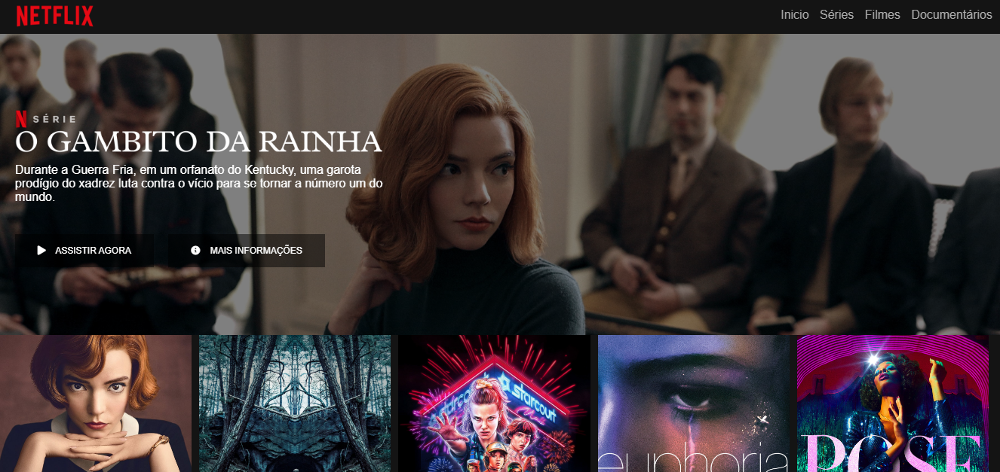

<h1 align="center"> Recriação do layout do Netflix </h1>
<h3 align="center"> 📝 Descrição do projeto </h3>
<p align="center"> Esse projeto foi desenvolvido como parte do processo de conclusão do <code>BOOTCAMP</code> de html web developer da Digital Innovation one. Nesse repositório, básicamente, fiz uma cópia do layout da página inicial da plataforma de catálogo de produções audio-visuais, o Netflix. </p> 

<p align="center">

<a href="https://github.com/RodrigoMoreiraDaSilva/Layout-Do-Netflix/issues">
  
</a>

<a href="https://github.com/RodrigoMoreiraDaSilva/Layout-Do-Netflix/blob/master/LICENSE">

</a>
<a href="https://github.com/RodrigoMoreiraDaSilva/Layout-Do-Netflix/network">
  
</a>
<a href="https://github.com/RodrigoMoreiraDaSilva/Layout-Do-Netflix/stargazers">
  
</a>
</p>

****
<p align="center">
   <b> 📈 Status do projeto: 📉 </b> <br>
   <i>codificando...</i> <br>
   ◼️◼️◼️◼️◼️◼️◼️◼️◻️◻️◻️◻️
</p>

****

### 📋 ÍNDICE

<!--ts-->
   * [Sobre](#Sobre)
        * [Descrição do Projeto](#--descrição-do-projeto-)
        * [Status do Projeto](#--descrição-do-projeto-)
   * [índice](#-índice)
   * [Recursos](#%EF%B8%8F-recursos)
   * [Demonstração](#-demonstração)
   * [Pré-Requisitos](#-pré-requisitos)
   * [Como visualizar](#-como-visualizar-)
   * [Tecnologias Utilizadas](#-tecnologias-utilizadas)
   * [Autor](#-autor)
<!--te-->

****

### ⚙️ Recursos

- [x] Uso da biblioteca JQuery de carrossel.
- [x] Layout dinâmico e semelhante ao original.
- [x] Cabeçalho/Barra de navegação com barra de pesquisa.
- [x] Carrossel com o catálogo de filmes e séries disponíveis.
- [ ] Sistema de sugestão de preenchimento na borda de pesquisa.
- [x] Modal dinâmico que exibe informações básicas do filme e/ou série.
- [ ] Sistema de busca simples que redireciona a tela ao elemento solicitado na busca.
- [ ] Menu drop-down (Menu suspenso) na barra de navegação que exibe as opções de cada seção do menu.
- [x] Botões funcionais que exercem funções no sistema do site (redirecionar para outras páginas e etc).
- [x] Uso de tooltips (Dicas de contexto) em determinadas partes do layout que explicam o que cada um dos botões fazem.
- [ ] Cabeçalho fixo e dinâmico que acompanha o scroll e altera seus atributos de acordo com o ponto em que a página se encontra.
- [ ] Responsividade: Interface multiplataforma que é projetada para ser eficiente e dinâmica em diversos tipos de resoluções (do mobile ao desktop).
- [x] Modal dinâmico: Uma pequena interface "pop up" animada que é exibida após clicar no filme, exibindo as principais opções e características do filme/série para o usuário.

****

### 🎥 Demonstração

<p align="center"><code> 🕗 VERSÃO 0.0.1 🕗 </code> </p>

> Na resolução de 1000px *(versão final do curso)*.



<p align="center"><code> 🕗 VERSÃO 1.0.0 🕗 </code> </p>

> Demonstração das funcionalidades dessa versão na resolução de 1000px `(responsividade ainda não configurada)`.


****

### 💾 Pré-Requisitos: 

- Para a execução desse projeto, não é necessário muita coisa, somente um conhecimento básico ou intermediário de html, css e javascript, além de ter baixado em sua máquina o framework Jquery [Owl Carousel](https://owlcarousel2.github.io/OwlCarousel2/).

> ☛ O framework já está incluido no repositorio, sendo assim, ao copiar o repositorio, tudo o que for necessário já estará incluso.

- Uma IDE é essencial, mesmo não sendo obrigatório, é bem aconselhável, pois as IDES ajudam muito no desenvolvimento do projeto. Recomendo o uso do [Visual Studio Code](https://code.visualstudio.com/download).

****

### 📲 Como visualizar <p id="#Como-visualizar"> 

- Para visualizar a página, primeiramente, copie o repositório em sua máquina. Para isso, no terminal, digite os seguintes comandos e pressione `enter` para realizar o procedimento:
```
# Criar clone local do projeto
$ git clone https://github.com/RodrigoMoreiraDaSilva/Layout-Do-Netflix.git

# Entrar no diretório
$ cd Layout-Do-Netflix
```
- Após clonar o repositório em sua máquina local, abra o diretório em seu editor de texto e confira se os diretórios estão sendo referenciados corretamente. Para visualizar a página, abra o arquivo `index.html` em seu navegador de preferência — particularmente, eu uso o [Opera](https://www.opera.com/pt-br/computer/opera) — e confira se tudo está sendo devidamente exibido. 

****

### 🛠 Tecnologias Utilizadas

- Principais tecnologias usadas no processo de criação desse projeto (clique nos badgers para ser direcionado para a `"documentação"` de cada tecnologia).

[](https://developer.mozilla.org/en-US/docs/Web/JavaScript)
[](https://owlcarousel2.github.io/OwlCarousel2/)
[](https://developer.mozilla.org/pt-BR/docs/Web/HTML)
[](https://developer.mozilla.org/pt-BR/docs/Web/CSS)

### 👨🏽‍💻 AUTOR
*****

<h5>Rodrigo Moreira 🌠</h5>
<p>🌐Desenvolvido por <b> <i>Rodrigo Moreira da Silva</b> </i> 👨🏽‍💼❤️
  
> Em conjunto com o Bootcamp de `Html web developer` da [Digital Innovation One](https://digitalinnovation.one).

[](https://twitter.com/RodrogaDev)
[](https://www.linkedin.com/in/rodrigo-m0reira-da-silva/)


****
<p align="center">
    <b> <i> Copyright (c) 2021 Rodrigo Moreira da Silva & Digital innovation One </i> </b>
</p>
  <p align="center"> <a href="https://github.com/RodrigoMoreiraDaSilva/Layout-Do-Netflix/blob/master/LICENSE">  </a> </p>