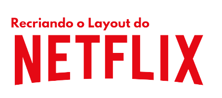

 

# **RECRIANDO LAYOUT DO NETFLIX** 

### 📋 Descrição do projeto
- Nesse projeto, basicamente, fiz uma recriação básica do layout do Netflix. 

### 

### 👨🏽‍💻 Tecnologias Utilizadas

- Principais tecnologias usadas no processo de criação desse projeto (clique nos badgers para ser direcionado para a `"documentação"` de cada tecnologia).

    

